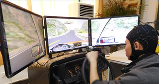
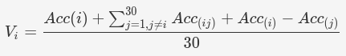
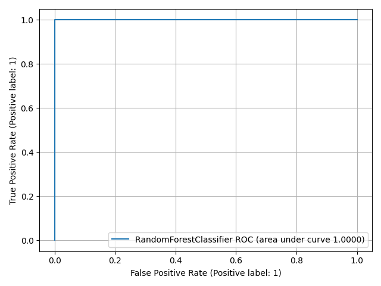
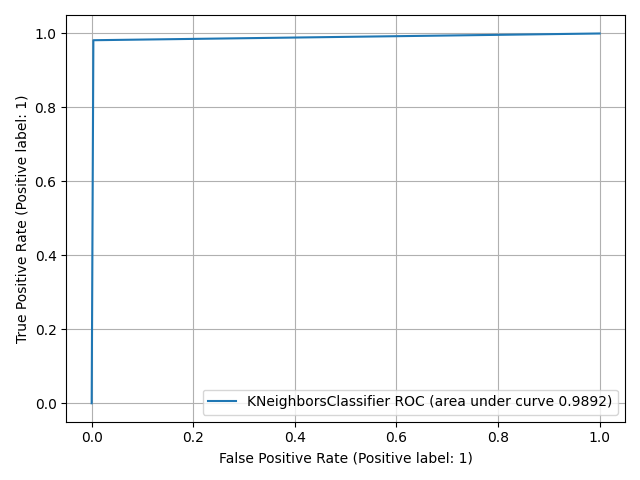

# Driver fatigue detection through multiple entropy fusion analysis in an EEG-based system

## https://journals.plos.org/plosone/article?id=10.1371/journal.pone.0188756
<p align="center">
	</img>
</p>

## Assignment
Implement steps described in the research paper and produce similar results.

**Grade: 40/40**

# Requirements

[requirements.txt](requirements.txt)


# Todo:

### Utils:
- [x] Create report file saver and loader for easy and reproducible way to check results

### Signal:
- [x] Apply filters to remove noise
	- [x] notch filter 50Hz
	- [x] band pass 0.15Hz to 40Hz
- [x] Crop the signal to 5 minutes (300 seconds) 
- [x] Load signal for all drivers

### Feature extraction
- [x] Create epochs from the raw signal using the window of 1 second
- [x] Create class for easier signal preprocessing procedures
- [x] Create class for dynamic feature extraction
- [x] Define features:
	- [x] 4 different entropies for each 1 second epoch
	- [x] standard deviation, mean, power density spectrum 
- [x] Use product of preprocessing procedures and feature extraction to extract more features

### Dataframe:
- [x] Concatenate features into a final dataframe
- [x] Clean the dataframe, replace bad values
- [x] Create a normalization process that avoids data leakage 

### Train:
- [x] Use LOO (leave one participant out) approach to find the best `C` and `gamma` parameters for the SVM model
- [x] Train the SVM model with multiple combinations of entropies (function `powerset`) to find out which entropy combination has the highest accuracy on the train dataset 
- [x] Train the following models using the Grid Search method:
	- [x] SVM
	- [x] Neural network (BP)
	- [x] KNN
	- [x] Random Forest (RF)
- [x] Validate accuracy using testing set and report performance on each model
- [x] Determine significant electrodes by calculating the weight for each electrode for each driver with the formula describe in the research paper:
	- 
	<!-- - $$V_i=\frac{Acc(i) + \sum_{j=1, j\not=i}^{30}{Acc_{(ij)} + Acc_{(i)} - Acc_{(j)}}}{30}$$ -->

### Improvements:
- [x] Fix the code in EntropyHub library (sample entropy) where NaN is returned by the `np.log` if the power density for a given frequency equals to 0
- [x] Add additional preprocessing procedure which decomposes signal to alpha and beta waves
- [x] ICA - Principal component analysis
	- [x] filter low 1hz to remove drifts	
- [x] Fix data leakage. Don't scale on the whole dataset. Scale only the train dataset seperatly of test data. Fit on train, transform on train, transform on test
- [x] Fix the code for dataframe creation - add interface that allows feature concaternation
- [x] Explore which features are most important for prediction

Optional:
- [ ] Visualize training/testing error
- [ ] Visualize weight-based topographies for each subject
- [ ] Visualize weight-based topographies average


# Figures

### 3 compontent (x,y, color) T-SNE of the dataset


## Metrics - 50:50 train test split

### Model comparison


### Receiver operating characteristic (ROC)

[RandomForestClassifier](https://scikit-learn.org/stable/modules/generated/sklearn.ensemble.RandomForestClassifier.html) (AUC = 1.0000) | [SVM](https://scikit-learn.org/stable/modules/generated/sklearn.svm.SVC.html) (AUC = 0.9928)
--- | ---
 | 

[KNeighborsClassifier](https://scikit-learn.org/stable/modules/generated/sklearn.neighbors.KNeighborsClassifier.html) (AUC = 0.9892) | [MLPClassifier](https://scikit-learn.org/stable/modules/generated/sklearn.neural_network.MLPClassifier.html) (AUC = 0.9861)
--- | ---
 | 


# Dataframe structure

## Rows
Each row is defined by a tripplet:
1. **driver** (driver_id)
2. **epoch** (epoch_id)
3. **driving state** (y=is_fatigue_state)

Number of rows:
```
drivers (NUM_DRIVERS=12) *
epochs (SIGNAL_DURATION_SECONDS_DEFAULT=300) *
driving_states (len(driving_states)=2)

12 * 300 * 2 = 7200 rows
```

## Columns
Each feature column is defined by a tripplet:
1. **feature** (`mean`, approximate entropy (`AE`), standard deviation (`std`)...)
2. **channel** (`FC4`, `T6`, `P3`...) - electrodes on the cap which driver wears during the driving session
3. **preprocess procedure** (`standard`, alpha waves (`AL`), channel rereferencing...)

Number of columns:
```
driver_id (1) +
is_fatigue_state (1) +
epoch_id (1) +
features (len(feature_names)=7) *
channels (len(channels_good)=30) *
N preprocess procedures (N <1, +>)

1 + 1 + 1 + 7 * 30 * N = 210 * N

in most cases N = 5 (standard, AL, AH, BL, BH)
num of cols = 1050
```


Total number of columns is product (multiplying) of feature (7), channels (30) and preprocess procedure (N)

Each driver has two driving states (normal and fatigue) which gives 2 raw signals for each driver.

Each signal consists of 300 seconds which will be transformed to 300 epochs.

For each epoch (row), all **columns** are caculated.

|     | is_fatigued | driver_id | epoch_id | CP3_PE_standard | CP3_PE_AL | ... | FT7_PE_standard |   FT7_PE_AL | ... |
| --- | ----------: | --------: | -------: | --------------: | --------: | --- | --------------: | ----------: | --- |
| 0   |           0 |         0 |        0 |        0.361971 |  0.361971 | ... |     1.84037e-23 | 1.84037e-23 | ... |
| 1   |           0 |         0 |        1 |        0.232837 |  0.232837 | ... |      1.4759e-23 |  1.4759e-23 | ... |
| 2   |           0 |         0 |        2 |        0.447734 |  0.447734 | ... |     1.27735e-23 | 1.27735e-23 | ... |
| 3   |           1 |         0 |        0 |         3.18712 |   3.18712 | ... |      1.4759e-23 |  1.4759e-23 | ... |
| 4   |           1 |         0 |        1 |         2.81654 |   2.81654 | ... |     1.27735e-23 | 1.27735e-23 | ... |

# Dataset notes

EEG data:
- .cnt files were created by a 40-channel Neuroscan amplifier including the EEG data in two states in the process of driving.

Entropy data (not used):
- four entropies of twelve healthy subjects for driver fatigue detection
- the digital number represents different participants
- each .mat file included five files
	- FE - fuzzy entropy
	- SE - sample entropy
	- AE - approximate entropy
	- PE - spectral entropy
	- Class_label 0 or 1
		- 1 represents the fatigue state
		- 0 represents the normal state

# Reserach paper notes
## Goal
analyze the multiple entropy fusion method and evaluate several channel regions to effectively detect a driver’s fatigue state based on electroencephalogram (EEG) records


## Data:
- collected by attaching electrodes to driver’s
- non-fatigue data: driver was driving for 20 minutes. Last 5 minutes are captured as non-fatigue
- fatigue data: driver was driving for 40-60 minutes. Last 5 minutes are captured as fatigue data. 
- dataset is split randomly 50:50 train/test
- 5 minute EEG data from 30 electrodes
	- sectioned into 1 second epoch
	- 5 * 60 = 300 * 1 = 300 epoch for one participant
	- total 3600 fatigue units and 3600 normal units 

## Electrode cap:
- 32 channels (30 effective and 2 reference channels)


## Entropies:
- PE - special entropy - calculated by applying the Shannon function to the normalized power spectrum based on the peaks of a Fourier transform
- AE - Approximate entropy - calculated in time domain without phase-space reconstruction of signal (short-length time series data) [41]
- SE - Sample entropy - similar to AE. Se is less sensitive to changes in data length with larger values corresponding to greater complexity or irregularity in the data [41]
- FE - Fuzzy entropy - stable results for different parameters. Best noise resistance using fuzzy membership function.

### Entropy Parameters (AE, SE, FE):
- m: dimension of phase space
	- m = 2
- r: similarity tolerance
	- r = 0.2 * SD (SD = standard deviation of the time series)

### Feature normalization
Features were normalized to [-1, 1] using min-max normalization:
1. Feature vector is built using the concatenation process, which concatenates the features.
2. The min-max normalization of each feature xi, i = 1,. . .,n, is computed as follows:


## 4 classifiers
1. Support vector machine (SVM)
2. Back propagation neural network (BP)
3. Random forest (RF)
4. K-nearest neighbor (KNN)

## SVM Parameters
With leave-one-out (LOO) cross-validation parameters :
1. c=-1 - the penalty parameter
2. g=-5 - the kernel parameter
3. AR order 10.

## Entropy combining
Combining multiple entropies always yields better accuracy.

## Significant electrodes

Significant electrodes were chosen from 30 electrodes.
1. Calculate Acc(i) of single i electrode using multiple entropy fusion method based on training data by SVM classifier
2. Obtain accuracy for each electrode and then recalculate it by combining pairwise electrode (with 29 electrodes)
3. Calculate the weight for each electrode $V_i=\frac{Acc(i) + \sum_{j=1, j\not=i}^{30}{Acc_{(ij)} + Acc_{(i)} - Acc_{(j)}}}{30}$

Pick 10 electrodes with biggest weight. These 10 electrodes produce 4 clusters/regions A,B,C,D.
- A gives the best prediction results and even better prediction compared when all electrodes were used for a prediction


# Notes to self:

1. Many channels are flatlined during the driving process and spike during some moments
2. In addition each BCIT dataset includes 4 additional EOG channels placed vertically above the right eye (veou), vertically below the right eye (veol), horizontally on the outside of the right eye (heor), and horizontally on the outside of the left eye (heol)
3. `ipython kernel install --driver --name=eeg` to use venv in jupyter
4. Two different libs (EntropyHub and Antropy) produce the same result for sample entropy
5. Applying filter before and after converting to epochs gives different results
