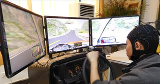

# Driver fatigue detection through multiple entropy fusion analysis in an EEG-based system

	
	
Paper: https://journals.plos.org/plosone/article?id=10.1371/journal.pone.0188756

# Notes:

Many channels are flatlined during the driving process and they spike only in some moments

# Todo:

- [ ] Load entropy and signals for all users
- [ ] Normalize across all participans and not single one
- [ ] Split the dataset (train/test 50:50)
	- use `is_normal_state_mask` you already created
- [ ] Remove entropy outliers
- [ ] Apply filters to remove noise
	- [ ] notch filter 
	- [ ] band pass 0.15Hz to 40Hz ?
- [ ] Epoch the signal using the window of 1 second
- [ ] Calculate 4 different entropies for each 1 second epoch
- [ ] Time window!? Timestamp can't be a feature
- [ ] Compare entropies with entropies from the paper
- [ ] Concatenate features into a final dataFrame
- [ ] Train the dataset with (SVM, BP, KNN, RF)
- [ ] Validate accuracy using testing set
- [ ] Use cross-validation to get better results
- [ ] Determine significant electrodes
	- [ ] Add them to "bad channels"
- [ ] Repeat training with significant electrodes

Optional:
- [ ] Visualize training/testing error
- [ ] Visualize weight-based topographies for each subject
- [ ] Visualize weight-based topographies average

# Requirements

[requirements.txt](requirements.txt)

`ipython kernel install --user --name=eeg` to use venv

# Questions:

What is the general approach, steps and techniques to prepare the EEG signal?

How is AR (auto-regression) is often mention in the paper. What it's use in the context of the problem?

Should I recalculate significant electrodes or pick the ones form the paper?

Page 5/19, min-max normalization on features: what are the features in this context, signal features or entropy features?

Should I implement all classifiers or only SVM/BP?

Rows are participants?
- **No!**, there are only 12 participants = 12 rows.

Should I one hot encode users and use time as rows ? 

How do I organize the final dataFrame. What are columns / rows?

# Data structure

Here, we will calculate the entropy (4) for every channel (30) for every epoch. In the research paper, they also did that but reduced number of entropies from (30 * 4) to (4) by doing a "a feature-level fusion"
| user_id | time | PE_CH01 | PE_CH02 | ... | PE_CH30 | SE_CH01 | SE_CH02 | ... | FE_CH30 |
| ------- | ---- | ----- | ----- | --- | ----- | ----- | ----- | --- | ----- |
| 01      | 1s | 0.3   | 0.23  | ... | 0.6   | 0.8   | 0.1   | ... | 0.2   |  |
| 01      | 2s | 0.2   | ...   |     |

broj redaka broj usera * uzoric vremena (epoha) = 3600 # testiranje

# Dataset notes

EEG data:
- .cnt files were created by a 40-channel Neuroscan amplifier including the EEG data in two states in the process of driving.

Entropy data:
- four entropies of twelve healthy subjects for driver fatigue detection
- the digital number represents different participants
- each .mat file included five files
	- FE
	- SE
	- AE
	- PE described four entropy values in the training data
	- Class_label 0 or 1
		- 1 represents the fatigue state
		- 0 represents the normal state

# Paper notes
## Goal
analyze the multiple entropy fusion method and evaluate several channel regions to effectively detect a driver’s fatigue state based on electroencephalogram (EEG) records

## Data:
- collected by attaching electrodes to driver’s
- non-fatigue data: driver was driving for 20 minutes. Last 5 minutes are captured as non-fatigue
- fatigue data: driver was driving for 40-60 minutes. Last 5 minutes are captured as fatigue data. 
- dataset is split randomly 50:50 train/test
- 5 minute EEG data from 30 electrodes
	- sectioned into 1 second epoch
	- 5 * 60 = 300 * 1 = 300 epoch for one participant
	- total 3600 fatigue units and 3600 normal units 

## Electrode cap:
- 32 channels (30 effective and 2 reference channels)

## Entropies:
- PE - special entropy - calculated by applying the Shannon function to the normalized power spectrum based on the peaks of a Fourier transform
- AE - Approximate entropy - calculated in time domain without phase-space reconstruction of signal (short-length time series data) [41]
- SE - Sample entropy - similar to AE. Se is less sensitive to changes in data length with larger values corresponding to greater complexity or irregularity in the data [41]
- FE - Fuzzy entropy - stable results for different parameters. Best noise resistance using fuzzy membership function.

### Entropy Parameters (AE, SE, FE):
- m: dimension of phase space
	- m = 2
- r: similarity tolerance
	- r = 0.2 * SD (SD = standard deviation of the time series)

### Feature normalization
Features were normalized to [-1, 1] using min-max normalization:
1. Feature vector is built using the concatenation process, which concatenates the features.
2. The min-max normalization of each feature xi, i = 1,. . .,n, is computed as follows:

## 4 classifiers
1. Support vector machine (SVM)
2. Back propagation neural network (BP)
3. Random forest (RF)
4. K-nearest neighbor (KNN)

## SVM Parameters
With leave-one-out (LOO) cross-validation parameters :
1. c=-1 - the penalty parameter
2. g=-5 - the kernel parameter
3. AR order 10.

## Entropy combining
Combining multiple entropies always yields better accuracy.

## Significant electrodes

Significant electrodes were chosen from 30 electrodes.
1. Calculate Acc(i) of single i electrode using multiple entropy fusion method based on training data by SVM classifier
2. Obtain accuracy for each electrode and then recalculate it by combining pairwise electrode (with 29 electrodes)
3. Calculate the weight V_i = Acc(i) + sum[ Acc(ij) + Acc(i) - Acc(j) ] / 30

Pick 10 electrodes with biggest weight. These 10 electrodes produce 4 clusters/regions A,B,C,D. A gives the best prediction results and even better prediction compared when all electrodes were used for a prediction. 
